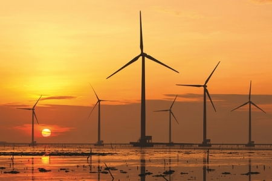
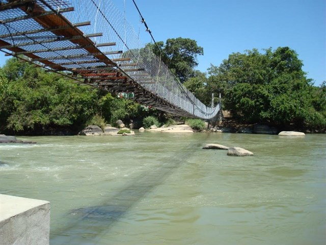
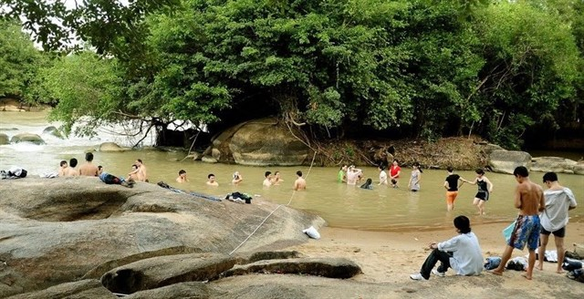

#Form đề nghị các địa điểm và nơi đi
https://docs.google.com/spreadsheets/d/1G2QZU7p3CVcostb67w0n4D_yWYAtQN-PEsBtjMN6gkI/edit?usp=sharing

# Plan đi chơi tháng 12

<!-- @import "[TOC]" {cmd="toc" depthFrom=1 depthTo=6 orderedList=false} -->
<!-- code_chunk_output -->

* [Form đề nghị các địa điểm và nơi đi](#form-đề-nghị-các-địa-điểm-và-nơi-đi)
* [Plan đi chơi tháng 12](#plan-đi-chơi-tháng-12)
			* [Thành viên tham gia tạm thời bao gồm:](#thành-viên-tham-gia-tạm-thời-bao-gồm)
			* [Tiêu chí chọn track, địa điểm để đi](#tiêu-chí-chọn-track-địa-điểm-để-đi)
			* [Đồ cần chuẩn bị](#đồ-cần-chuẩn-bị)
* [Plan 1: Cánh đồng quạt gió Bạc Liêu](#plan-1-cánh-đồng-quạt-gió-bạc-liêu)
			* [Tóm tắt: Cả đi và về là 600km, hành trình về miền Tây, địa điểm ít được đi](#tóm-tắt-cả-đi-và-về-là-600km-hành-trình-về-miền-tây-địa-điểm-ít-được-đi)
* [Plan 2: Cắm trại Thăm thác Mai trên dòng sông La Ngà](#plan-2-cắm-trại-thăm-thác-mai-trên-dòng-sông-la-ngà)
			* [Tóm tắt: Chỉ cách thành phố Hồ Chí Minh khoảng hơn 100km, cả đi và về vào khoảng 300km](#tóm-tắt-chỉ-cách-thành-phố-hồ-chí-minh-khoảng-hơn-100km-cả-đi-và-về-vào-khoảng-300km)
* [Plan 3: Tây Nguyên (Ưu tiên, chưa đi)](#plan-3-tây-nguyên-ưu-tiên-chưa-đi)
* [Plan 4: Nha Trang](#plan-4-nha-trang)
* [Plan 5: Đà nẵng](#plan-5-đà-nẵng)
* [Plan 6: Daklak](#plan-6-daklak)
* [Plan 7: Phú Yên](#plan-7-phú-yên)

<!-- /code_chunk_output -->

Vào đầu tháng 12 chúng ta sẽ tổ chức một cuộc bào tour cho những ngày bị kìm nén.
Ngày đẹp là thứ 7 chủ nhật tuần đầu tiên của tháng 12
Vào ngày  2/12 và 3/12

#### Thành viên tham gia tạm thời bao gồm:
- Khương
- Linh
- Thành
- Thêm người nếu thích
- Có thể chở thêm gái nếu thích

#### Tiêu chí chọn track, địa điểm để đi
Đường phải đẹp. **Chưa biết đi đâu?**

++Ưu tiên đoạn đường có các tiêu chí sau:++
- Tổng quãng đường vào khoảng 300km cho đi và về, tối ưu giữa bào và ăn chơi
- Tốc độ di chuyển đều giống như trước giờ, khoảng 70km/h trở lên
- Đường đẹp
- Đường dài
- Đổ đèo
- Thích đi đèo thì chọn đèo
- Thích đi biển thì chọn view biển

**Miền Tây** ít đi thì nên thử:
Nhà máy điện gió Bạc Liêu cũng hay
Cần thêm đề nghị :smile:

#### Đồ cần chuẩn bị
- Đây là những món cần mang, mọi thứ có thể tùy thuộc vào hành trình và thời tiết để chọn giữa lều và nhà nghỉ homstay khách sạn
- Sẽ tự linh hoạt khi chở theo thêm ôm ngồi sau.
-Chú ý: xe nhớ bảo dưỡng trước khi đi,

Đồ cần mang  | Người chuẩn bị (Linh, Khương, Thành)| số lượng|OK
---|--- |--- |---
Mũ bảo hiểm Fullface|cá nhân|1|OK
Mũ bảo hiểm Fullface|cá nhân|1|OK
Áo mưa bộ | cá nhân | 1|OK
Lều 4 người | dùng chung (Thành)|1|OK
Tấm cách nhiệt | dùng chung(Thành) |1  |OK
Quạt điện cầm tay, chống nóng khi ngủ lều|cá nhân|1|OK
Pin sạc dự phòng|cá nhân|1|OK
Dây sạc Android/iPhone|cá nhân|1|OK
Thuốc đau bụng, thuốc hạ sốt, dầu gió|cá nhân|1|OK
Bọc giày chống mưa (có thể dùng bao nilong thay thế)|cá nhân|1|OK
Áo quần 2 bộ tùy|cá nhân|2|OK
Dây ràng đồ |cá nhân | 2|OK
Bàn chải đánh răng | cá nhân         | 1|OK
kem đánh răng | cá nhân         | 1|OK
dầu gội đầu | cá nhân         | 1|OK
chai xịt chống nước cho kính nón bảo hiểm và các loại kính | dùng chung| 1|OK

# Plan 1: Cánh đồng quạt gió Bạc Liêu
#### Tóm tắt: Cả đi và về là 600km, hành trình về miền Tây, địa điểm ít được đi

**Giới thiệu:**
Là một tỉnh nằm trong khu vực đồng bằng sông Cửu Long nhưng Bạc Liêu là điểm đến ít được khách du lịch chú ý, nhiều người biết đến Bạc Liêu chủ yếu bởi các giai thoại xoay quanh nhà “Công tử Bạc Liêu”, nhưng với việc nơi đây sở hữu cánh động quạt gió có quy mô lớn nhất Việt Nam cũng khiến bạn phải suy nghĩ đến một chuyến đi tới đây càng sớm càng tốt.

**Cách đi:**
Từ trung tâm thành phố Bạc Liêu bạn theo đường Cao Văn Lầu đi ra phía biển, ở địa phận ấp Biển Đông A, xã Vĩnh Trạch Đông sẽ đến với cánh đồng quạt gió. Khoảng cách từ trung tâm thành phố đến nhà máy khoảng gần 20km, nhưng từ cách xa cả chục cây số, bạn đã có thể nhìn thấy những trụ turbine lắp cánh quạt quay đều như những chong chóng khổng lồ in trên nền trời.

# Plan 2: Cắm trại Thăm thác Mai trên dòng sông La Ngà
#### Tóm tắt: Chỉ cách thành phố Hồ Chí Minh khoảng hơn 100km, cả đi và về vào khoảng 300km

**Giới thiệu:**

Thác Mai là một địa điểm hoang sơ thuộc huyện Định Quán,Tỉnh Đồng Nai được ví là "Rừng Amazon của Đồng Nai".Đây sẽ là một địa điểm hấp dẫn với nhiều điều bí ẩn lẫn hoang dã hứa hẹn mang đến cho bạn nhiều trải nghiệm mới và mở rộng "vùng thoải mái" của chính bản thân mình.

Chỉ cách thành phố Hồ Chí Minh khoảng hơn 100km.Bạn có thể chinh phục Thác Mai với chỉ 1 ngày hoặc 2 ngày cuối tuần.Một bí mật nữa là chi phí dành cho chuyến hành trình này rất rẻ sẽ khiến bạn bất ngờ nếu như bạn chuẩn bị tốt.Và bây giờ hãy bắt đầu chuyến đi với những điều thú vị mà bạn sẽ được khi đến với Thác Mai nhé

Những điều thú vị mà bạn sẽ được trải nghiệm trên hành trình đến với Thác Mai:
1.Tham quan làng nuôi cá bè La Ngà
2. Chạy xe chinh phục con đường rừng dẫn vào trong thác

3. Ngâm chân và tắm với nước khoáng nóng tại Bầu Nước Sôi
4. Câu cá thiên nhiên
5. Tắm Thác
6. Cắm Trại, đốt lửa trại, tổ chức team building hoặc đơn giản là khám phá rừng "đi tìm thượng nguồn con thác"
Tham khảo thêm tại: http://www.thueleudulich.com/2015/03/lich-trinh-trai-nghiem-cam-trai-tai.html

# Plan 3: Tây Nguyên (Ưu tiên, chưa đi)
# Plan 4: Nha Trang
# Plan 5: Đà nẵng
# Plan 6: Daklak
# Plan 7: Phú Yên
